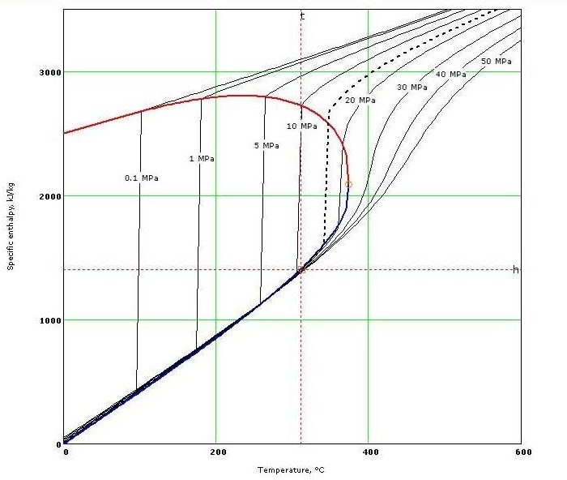

# From Intimidation to Enjoyment

Thermodynamics has often suffered from a reputation as a daunting and complex subject, intimidating even the most enthusiastic learner.
Its dense equations and abstract concepts have led many to perceive it as a formidable obstacle to be overcome.
However, beneath this veneer of complexity lies a fascinating realm of understanding about the behaviour of energy and matter in our universe which also can be broken down to the simple art of cooking.

A basic understanding of thermodynamics can be not only enlightening, but also surprisingly enjoyable.
It offers insights into everyday phenomena, from the steam rising from a cup of coffee to the workings of a boiling pot.

It also provides a framework for understanding the fundamental principles that govern the natural world, enabling individuals to make sense of complex systems and phenomena.

??? info

    Which we will not cover here on this page.

## From liquid to gas

The phase change from liquid to gas is crucial in cooking as it facilitates various essential processes.
When water reaches its boiling point and transitions into steam, it creates a powerful mechanism for transferring heat.

This transfer of energy is vital for cooking food evenly and efficiently, whether it's boiling vegetables, simmering soups, or steaming rice.
Additionally, the expansion of water into steam can impart moisture and flavor to the food being cooked, enhancing its texture and taste.

Moreover, the phase change allows for the release of volatile compounds present in the ingredients, contributing to the aroma and overall culinary experience.

### Water

Ochkov, Valery & Alexandrov, Alexey & Orlov, K. & Znamensky, Vsevolod. "Cloud" service on properties of working mediums and materials in nuclear power engineering.

### Oil

The phase change from liquid to gas significantly impacts cooking oils due to their varied boiling points.

Oils with lower boiling points, such as olive oil or sunflower oil, reach their boiling point relatively quickly when heated, resulting in the production of steam.
This steam can aid in the cooking process by transferring heat efficiently and contributing to the texture and flavor of the food.

On the other hand, oils with higher boiling points, like peanut oil or coconut oil, require more intense heat to reach their boiling point and transition into steam.

Understanding the boiling points of different oils is essential for selecting the appropriate oil for specific cooking methods.

For instance, oils with higher boiling points are ideal for deep-frying, as they can withstand the high temperatures needed to cook food quickly without smoking or burning.
Conversely, oils with lower boiling points are better suited for sautéing or shallow frying, where moderate heat is sufficient to cook the food while preserving its delicate flavors.

Thus, the phase change from liquid to gas plays a crucial role in determining the cooking performance of various oils based on their boiling points.

|Oil|Boiling point|
|---|---|
|Olive Oil|190° C|
|Canola Oil|204° C|
|Vegetable Oil|204-232° C|
|Sunflower Oil|227° C|
|Peanut Oil|232° C|
|Corn Oil|232° C|
|Soybean Oil|232° C|
|Safflower Oil|232° C|
|Coconut Oil|177° C|
|Avocado Oil|271° C|

## Heat transfer mechanics
