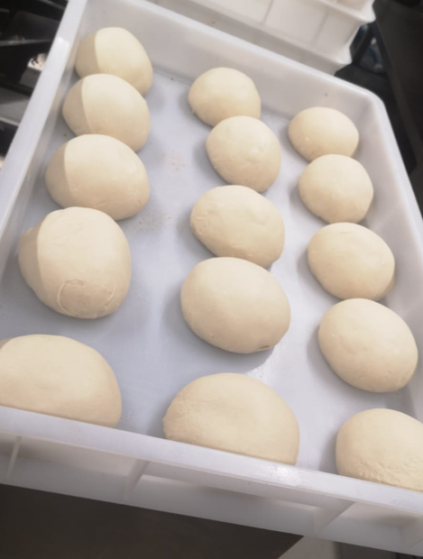

# Pizza Napoletana

Pizza Napoletana, also known as Neapolitan pizza, is a culinary treasure revered worldwide for its simplicity and exquisite taste.
Originating from Naples, Italy, this traditional pizza style boasts a thin, soft, and slightly charred crust, created from high-protein flour, natural yeast, salt, and water, kneaded and left to rise for hours.
The toppings are kept minimalistic, typically featuring San Marzano tomatoes, fresh mozzarella cheese made from buffalo milk, extra virgin olive oil, and basil leaves, resulting in a harmonious blend of flavors that burst with authenticity.
Cooked in a wood-fired oven at blazing temperatures, Pizza Napoletana achieves a perfect balance of crispiness and chewiness in every bite, making it a culinary delight revered by pizza enthusiasts worldwide.

## Dough

- __Ingredients__

    ---

    === "for 2-3"

        * 0,5 kg flour
        * 0,5 g yeast
        * 0,3 l water
        * 15,625 gr salt

    === "for 5-6"

        * 1 kg flour
        * 1 g yeast
        * 0,6 l water
        * 31,25 gr salt

    === "for 10-11"

        * 2 kg flour
        * 2 g yeast
        * 1,2 l water
        * 62,5 gr salt

- __Procedure__

    ---
    <ol>
    <li>Mix the flour and the yeast.</li>
    <li>Gradually add the water.</li>
    <li>Add the salt.</li>
    <li>Mix until the dough has approx. 22° C.</li>
    <li>Extract the dough and portion it (approx. 290 gr / orb)</li>
    <li>["Mozzarella"](napoletana.md#polishing-the-surface) the surface.</li>
    <li>[Grind the orb](napoletana.md#grinding-the-orb).</li>
    <li>Leave the orbs to rest for 12 h at room temperature. Longer if stored in the fridge.</li>
    <li>[Roll the dough out](napoletana.md#roll-out-the-dough).</li>
    </ol>

??? info "Consistency above Recipey"

    You cannot weigh perfectly.
    Even if you could, there are many more variables that go into making the dough.
    Therefore, once you have some experience, you should know how you want your dough to feel.
    Do not follow the recipe too closely, but trust what you know will make a good Pizza.

??? tip "Temperature Control"

    To give yourself more room to manoeuvre, especially during a hot summer, use cooled water or substitute some parts of the water with ice cubes.
    With this method, you should use the weight instead of the volume, since 1 kg of ice cubes is equal to 1 kg of water.

### Smoothing the surface

Before resting the dough, we need to make sure that the surface is closed.

To do this, look for an already smooth part of the cut dough.
Stretch this part slightly and place your pressed thumb and index fingertips on this smooth part.
Now squeeze from underneath and push the dough through the hole your fingers created.
When almost all of the dough has been pushed through, squeeze the hole to form an orb.

The surface should be smooth, except for the part that was pushed last.
The orb should look a little like a Mozzarella ball.

### Grinding the orb

The cut needs to be smoothed out as well.
Therefor we put the orb in hour palm and roll it with the cut facing the surface in a wiggling motion.

This will smooth out the rough cut surface.

The final orbs will look like this:

### Roll out the Dough

??? warning "Rolling Pin Method"

    Be careful while rolling out the dough, since applying too much pressure will destroy the air bubbles we have introduces with the yeast.

??? info "Using Semola"

    Semola prevents the dough from sticking to the surface.
    Do not be afraid to use it, the right amount will stick to the ball by itself.

Pile up some *Semola* and place the orb on top.
Start by "massaging" the orb in the center.
Use the fingertips of both hands for that.
From there, begin to stretch out the dough a little.
Do not use too much force, if you feel more resistance, rotate the dough a bit and stretch another part.
Continue until you have a platelike mass about the size of your palm.

??? warning "Do not smush the edge"

    As with the rolling pin, massaging the future crust will prevent it from becoming fluffy.
    Try working from the center instead.

??? tip "Do not stress the gluten"

    Because gluten forms a network, too much force will tear it apart, especially in its early stages.
    Give the dough a little time to adjust to its new shape after initial rolling.

From that point, continue stretching the dough until you have achieved the desired size.
The dough should now be round, thin in the center and having a slightly thicker edge.

The difference in rising is mostly due to the load of sauce and topping, so the center will remain thin while the edge evolves into a beautiful crust.

??? info "Small holes"

    The dough can sometimes tear despite careful handling.
    Smaller tears can be fixed by pinching the dough.

## Sauce

The original sauce does not need much.
The golden rule of KISS, <i><b>K</b>eep <b>I</b>t <b>S</b>imple (<b>S</b>tupid)</i>, applies here as well.

- __Ingredients__

    ---

    === "for 25 cm"

        Stop and make a proper sized Pizza.

    === "for 30 cm"

        * 110 gr tomato pulp
        * a pinch of salt
        * some Oregano

    === "for 35 cm"

        * 170 gr tomato pulp
        * a pinch of salt
        * some Oregano

- __Procedure__

    ---
    <ol>
    <li>If you use tomatoes, turn them into a pulp.</li>
    <li>Add the salt to the pulp.</li>
    <li>Add the Oregano to the salted pulp.</li>
    </ol>
     Some like to add olive oil, I prefer to leave out the salt, for the dough and the topping should provide enough.
    In some recipes the Oregano is left out.
    Experiment and find what suits you best.

## Toppings

### Cheese

Use a good Mozzarella.

As well as the aforementioned Mozzarella di Buffala, there are other options that deserve more than an honourable mention.

*Fior di Latte* is just as commonly used.
It stands for *The bloom of cow's milk* and is widely regarded as one of the best choices for Pizza Napoletana.
